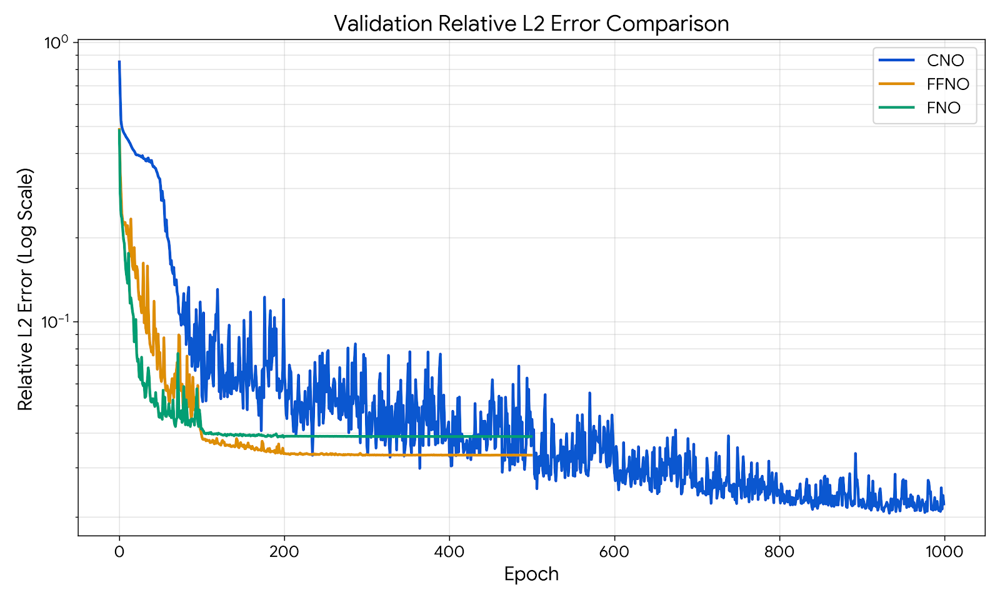
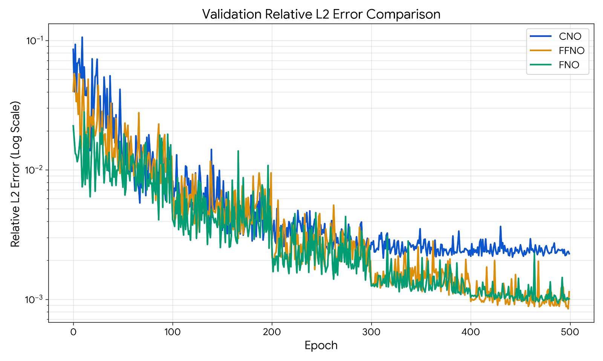
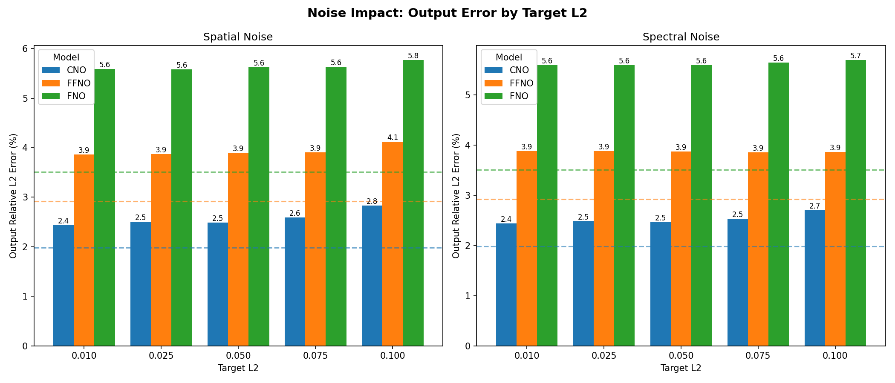

[[_TOC_]]

# Adversarial Robustness and Functional Attacks in Neural Operators

This project evalutes the efficiency of a number of attacks against Fourier Neural Operator, Factorized Fourier and Convolutional Neural Operators, on the 2D Darcy and 2D Navier Stokes equations.

We currently support the follow attack configurations:
- Random noise (spatial and spectral) of up to a configurable `rel_l2` distance from the input.
- Spatial PGD attack against the discretized function representation with configurable `eps` and number of steps.
- Spectral PGD attack against the fourier transformed function representation. ith configurable `eps` and number of steps.
- Physical loss (aka "stealth") enhance PGD attacks with configurable weights.
- Boundary condition attack (Darcy only)
- Maximum Violated Multi-Objective Attack (MVMO, Darcy-only)
- Sequential attack (Navier Stokes only)

## High level description

The code is structured into two major directories, 'simple' and 'temporal', 'simple' containing the implementation of the 2D Darcy equation which is a map from the permiability field (represented as a x,y grid) of the fluid in a 2D domain $a(.)$ to it's pressure $u(.)$. The 'temporal' directory contains the implementation of the autoregressive 2D Navier Stokes equation, mapping a vorticity field $u(., t)=w(x, y, t)$ which maps to the vorticity $w(x, y, t)$ at a given timestep `t` to $u(., t+dt)=w(x, y, t+dt)$. By repeatedly using the model output, we can iterate through time at a configured interval between timesteps `dt`.

The `simple/train.py` script contains the training loop, and the the `simple/darcy_2d` directory contains the necessary scripts for configuring the Darcy training data loading, loss functions, attack and evaluation scripts. Similarly, `temporal/ns_2d` contains the necessary scripts for the Navier Stokes 2D equation.

The generated datasets used in this project are available on [Polybox](https://polybox.ethz.ch/index.php/s/SNxpHfcDiXHWmBx), as well as the trained model snapshots that the report is based on, however the sections below describe how to generate new datasets and train new models.

## Requirements

We recommend using Python version 3.11+, a venv, and doing pip install -r requirements.txt. The library requirements are described in requirements.txt.

## Generating the training data

The `simple/darcy_2d/data` and `temporal/ns_2d/data` directories contain data generation scripts that solve the Darcy Flow (using a reference implementation of the Finite Difference Method) and the Navier Stokes equations (using reference implementations of the Pseudo-Spectral Method combined with a Crank-Nicolson timestepping scheme) and generate the data in the H5 format accepted by the training script. 

> [!IMPORTANT]
> If you generate your own data, please update the data configuration files located at `simple/darcy_2d/train_data.toml`, `simple/darcy_2d/attack_data.toml`, `temporal/ns_2d/data.toml` and `temporal/ns_2d/attack_data.toml`. The currently submitted data files assume that they will be downloaded from [Polybox](https://polybox.ethz.ch/index.php/s/SNxpHfcDiXHWmBx), and are using the filenames of the files there.

### Generating Darcy Flow data
To generate Darcy flow data, run the data generation module:
```bash
python -m simple.darcy_2d.data.generate_darcy_data [ARGUMENTS]
```

The supported arguments are:
| Argument | Type | Default | Description |
|----------|------|---------|-------------|
| `--n_samples` | int | 100 | Number of samples to generate |
| `--output_dir` | str | `simple/darcy_2d/data` | Output directory for generated data |
| `--resolutions` | int (list) | 64 128 256 | List of resolutions to generate |
| `--force_term` | float | 1.0 | Force term value |
| `--prefix` | str | `pdebench_darcy_` | Filename prefix for output files |

Example Usage
```bash
# Generate with defaults
python -m simple.darcy_2d.data.generate_darcy_data

# Custom configuration
python -m simple.darcy_2d.data.generate_darcy_data \
    --n_samples 1000 \
    --output_dir simple/darcy_2d/data \
    --resolutions 32 64 128 \
    --force_term 1.0 \
```

### Generating Navier-Stokes 2D data
To generate Navier-Stokes 2D training data, run the data generation module:

```bash
python -m temporal.ns_2d.data.generate_ns_data_legacy [ARGUMENTS]
```

| Argument | Type | Default | Description |
|----------|------|---------|-------------|
| `--n_samples` | int | 100 | Number of samples to generate |
| `--batch_size` | int | 20 | Batch size for generation |
| `--output_dir` | str | `./data` | Output directory for generated data |
| `--resolutions` | int (list) | 32 64 128 | List of resolutions to generate |
| `--viscosity` | float | 1e-3 | Viscosity coefficient (ν) |
| `--t_final` | float | 10.0 | Final simulation time |
| `--record_steps` | int | 50 | Number of time steps to record |
| `--prefix` | str | `ns_data_` | Filename prefix for output files |

```bash
# Generate with defaults
python -m temporal.ns_2d.data.generate_ns_data_legacy

# Custom configuration
python -m temporal.ns_2d.data.generate_ns_data_legacy \
    --n_samples 100 \
    --batch_size 8 \
    --output_dir temporal/ns_2d/data \
    --resolutions 32 64 128 \
    --viscosity 1e-4 \
    --t_final 10.0 \
    --record_steps 50 \
    --prefix ns_data_
```

## Training the base models

The training script accepts a model configuration described as a TOML file (which contains parameters such as the number of epochs, learning rate, optimizer parameters), as well as a data configuration file which describes the training data file as well as the physical constants that were used during the data generation. The available configurations describe the model snapshots that were used in our report.

| Darcy 2D Training | Navier Stokes 2D Training |
| :---: | :---: |
|  |  |

In order to train a 2D Darcy model, the training script can be called using one of the following commands (depending on the type of model, FNO, FFNO or CNO):
```
python -m simple.train --problem="simple_darcy_2d" --model_config=simple/darcy_2d/fno_model.toml --data_config=simple/darcy_2d/train_data.toml --output_model=simple/darcy_2d/trained_models/best_fno_model.pth
python -m simple.train --problem="simple_darcy_2d" --model_config=simple/darcy_2d/ffno_model.toml --data_config=simple/darcy_2d/train_data.toml --output_model=simple/darcy_2d/trained_models/best_ffno_model.pth
python -m simple.train --problem="simple_darcy_2d" --model_config=simple/darcy_2d/cno_model.toml --data_config=simple/darcy_2d/train_data.toml --output_model=simple/darcy_2d/trained_models/best_cno_model.pth
```

Similarly for Navier Stokes:
```
python -m temporal.train --problem temporal_ns_2d --model_config=temporal/ns_2d/fno_model.toml --data_config=temporal/ns_2d/data.toml --output_model=temporal/ns_2d/trained_models/best_fno_model.pth
python -m temporal.train --problem temporal_ns_2d --model_config=temporal/ns_2d/ffno_model.toml --data_config=temporal/ns_2d/data.toml --output_model=temporal/ns_2d/trained_models/best_ffno_model.pth
python -m temporal.train --problem temporal_ns_2d --model_config=temporal/ns_2d/cno_model.toml --data_config=temporal/ns_2d/data.toml --output_model=temporal/ns_2d/trained_models/best_cno_model.pth
```

## Running a benchmark of attack/evaluation loops.

The sections below this describe how to perform individual attacks and evaluations, but we provide a script that runs the pipeline end to end:
```bash
python -m temporal.ns_2d.run_benchmark
```

It performs the attacks described in the TOML files (`fno_attack_config.toml`, `ffno_attack_config.toml`, `cno_attack_config.toml`), and generates an overall report about the success of the attacks under `benchmark_results`.

## Attacking the models.

We implemented two scripts that generate adversarial examples for Darcy Flow and Navier-Stokes models using various attack strategies:

```bash
# Darcy Flow
python -m simple.darcy_2d.attack --attack_config path/to/darcy_attack_config.toml

# Navier-Stokes
python -m temporal.ns_2d.attack --attack_config path/to/ns_attack_config.toml
```

These scripts accept an attack configuration that described both the file locations, model directories and the attacks to perform. Note that we provided the `fno_attack_config.toml`, `ffno_attack_config.toml`, `cno_attack_config.toml` configs in both the Darcy and NS directories that were used to perform the attacks described in our report.

### Configuration File Structure

#### General Settings

```toml
[general]
resolution = 128          # Spatial resolution (e.g., 128×128)
n_samples = 10            # Number of adversarial examples to generate
output_dir = "output/"    # Directory for output H5 and JSON files
```

#### Model Paths

```toml
[model]
model_config_path = "path/to/model.toml"     # Model architecture config
model_path = "path/to/weights.pth"           # Trained model weights
data_config_path = "path/to/data.toml"       # Clean input data config
```

#### PGD Attack Parameters

```toml
[pgd]
epsilon = [0.1, 0.05, 0.01]    # Relative L∞ perturbation bounds (list for grid search)
steps = 200                    # Number of optimization iterations
alpha = 0.005                  # Step size per iteration
batch_size = 64                # Batch size for attack computation
target_l2 = [0.1, 0.05, 0.01]  # Relative L2 norm targets (for noise attacks)
smooth_grad = false            # Enable gradient smoothing
kernel_size = 5                # Smoothing kernel size (if smooth_grad=true)
sigma = 1.0                    # Smoothing sigma (if smooth_grad=true)
```

#### Physics-Informed Attack Weights

```toml
[physics]
lambda_pde = [0.1, 10.0, 100.0]   # PDE residual penalty (higher = more "stealth")
lambda_bc = [0.1, 10.0, 100.0]    # Boundary condition penalty
```

#### Active Attacks (Toggle On/Off)

```toml
[active_attacks]
# Standard Attacks (maximize prediction error)
spatial_pure = true       # PGD in pixel space
spectral_pure = true      # PGD in Fourier space

# Stealth Attacks (maximize error while minimizing physics violation)
spatial_stealth = true    
spectral_stealth = true   

# Other Attack Types
mvmo = true               # Min-Variance Max-Output attack
boundary = true           # Boundary-only perturbations
consistency = true        # Self-supervised consistency attack
spectral_targeted = true  # Target specific frequency bands

# Noise Baselines
spectral_noise = true     # Random Fourier noise
spatial_noise = true      # Random pixel noise
```

#### Frequency Targeting (Optional)

```toml
[frequency]
target_min = 10.0         # Minimum wavenumber to attack
target_max = 25.0         # Maximum wavenumber to attack
```

---

### Attack Types Summary

| Attack | Description |
|--------|-------------|
| `spatial_pure` | Standard PGD attack in pixel space |
| `spectral_pure` | PGD attack in Fourier domain |
| `spatial_stealth` | Physics-constrained spatial attack |
| `spectral_stealth` | Physics-constrained spectral attack |
| `mvmo` | Minimizes variance while maximizing output error |
| `boundary` | Perturbs only boundary pixels |
| `spectral_noise` | Baseline: random Fourier perturbations |
| `spatial_noise` | Baseline: random pixel perturbations |

---

### Example Usage

```bash
# Darcy: FNO model attack
python -m simple.darcy_2d.attack \
    --attack_config simple/darcy_2d/fno_attack_config.toml

# Darcy: FFNO model attack
python -m simple.darcy_2d.attack \
    --attack_config simple/darcy_2d/ffno_attack_config.toml

# Navier-Stokes: FNO model attack
python -m temporal.ns_2d.attack \
    --attack_config temporal/ns_2d/fno_attack_config.toml
```

#### Output Files

For each attack and parameter combination, the script generates:

- `attack_{type}_{suffix}.h5` — Adversarial samples (HDF5)
- `attack_{type}_{suffix}.json` — Attack parameters used

## Evaluating individual attacks.

After generating adversarial examples, evaluate model robustness using the evaluation script.

```bash
# Darcy Flow
python -m simple.darcy_2d.evaluate \
    --model_config path/to/model.toml \
    --model_path path/to/weights.pth \
    --data_path path/to/attack_*.h5 \
    --output_dir eval_results/

# Navier-Stokes
python -m temporal.ns_2d.evaluate \
    --model_config path/to/model.toml \
    --model_path path/to/weights.pth \
    --data_path path/to/attack_*.h5 \
    --output_dir eval_results/
```

### Evaluation Arguments

| Argument | Type | Default | Description |
|----------|------|---------|-------------|
| `--model_config` | str | *required* | Path to model architecture config (TOML) |
| `--model_path` | str | *required* | Path to trained model weights |
| `--data_path` | str | *required* | Path to adversarial data (H5 file) |
| `--target_path` | str | None | Path to ground truth data (if separate) |
| `--output_dir` | str | `eval_results` | Directory for evaluation outputs |
| `--plot_samples` | int | 10 | Number of samples to visualize |
| `--force_term` | float | 1.0 | Forcing term for physics loss |
| `--cross_res_mode` | str | None | Cross-resolution mode: `low`, `high`, or None |
| `--base_res` | int | None | Base resolution the attack was generated at |

### Evaluation Outputs

The script generates:

- `summary.txt` — Human-readable robustness report
- `benchmark_metrics.json` — Machine-readable metrics
- `sample_*_eval.png` — Per-sample visualization (Darcy)
- `sample_*_dynamics.png` — Temporal evolution plots (Navier-Stokes)
- `sample_*_snapshots.png` — Time snapshot comparisons (Navier-Stokes)

### Metrics Computed

| Metric | Description |
|--------|-------------|
| `avg_output_rel_l2` | Average relative L2 error |
| `avg_output_abs_l2` | Average absolute L2 error |
| `avg_pde_loss` | Average PDE residual |
| `avg_bc_loss` | Average boundary condition violation |
| `amplification_ratio` | Output error / Input perturbation |
| `spectral_changes` | Low/high frequency energy shifts |


### Example Usage

```bash
# Darcy: Evaluate FNO noise attack
python -m simple.darcy_2d.evaluate --model_config=simple/darcy_2d/fno_model.toml --model_path=simple/darcy_2d/trained_models/best_fno_model.pth --data_path=simple/darcy_2d/data/attack/fno/clean/attack_noise_spatial_l20.1.h5 --output_dir=simple/darcy_2d/eval/manual_noise/0.1

# NS: Evaluate FNO Noise attack
python -m temporal.ns_2d.evaluate --model_config=temporal/ns_2d/fno_model.toml --data_config=temporal/ns_2d/attack_data.toml --model_path=temporal/ns_2d/trained_models/best_fno_model.pth --output_dir=temporal/ns_2d/eval/fno/manual/attack --data_path=temporal/ns_2d/data/attack/fno/attack_noise_spectral_l2_0.1.h5
```
---

## Example Visualizations

### Darcy Flow Evaluation


*Visualization showing: adversarial input, ground truth, model prediction, absolute/relative error maps, physics residual, and spectral analysis.*

### Navier-Stokes Evaluation

**Temporal Dynamics:**


*Vorticity evolution over time comparing ground truth vs. model prediction under adversarial perturbation.*

**Time Snapshots:**


*Side-by-side comparison at selected time steps showing error accumulation.*

## Full benchmark

Run comprehensive benchmarks across multiple models and attack types.

```bash
# Run full benchmark (attacks + evaluation + plots)
python -m simple.darcy_2d.run_benchmark

# Gather results only (skip attack generation)
python -m simple.darcy_2d.run_benchmark --gather_only

# Custom output directory
python -m simple.darcy_2d.run_benchmark --output_dir benchmark_results/
```

### Benchmark Arguments

| Argument | Type | Default | Description |
|----------|------|---------|-------------|
| `--gather_only` | flag | False | Skip attack generation, only aggregate existing results |
| `--output_dir` | str | `simple/darcy_2d/benchmark_results` | Directory for benchmark outputs |

### Benchmark Outputs

The benchmark generates:

- `benchmark_metrics_summary.csv` — Aggregated metrics across all attacks/models
- `plots/` — Directory containing visualization plots

### Example Benchmark Plots

**Noise Baseline Impact:**



*Comparison of spatial vs. spectral noise impact across models at different perturbation levels. Dashed lines indicate clean baseline performance.*

**Attack Effectiveness by Perturbation Magnitude:**


*Output error grouped by absolute input perturbation magnitude, comparing attack categories (Clean, Noise, PGD-Pure, PGD-Stealth, etc.) across models.*
